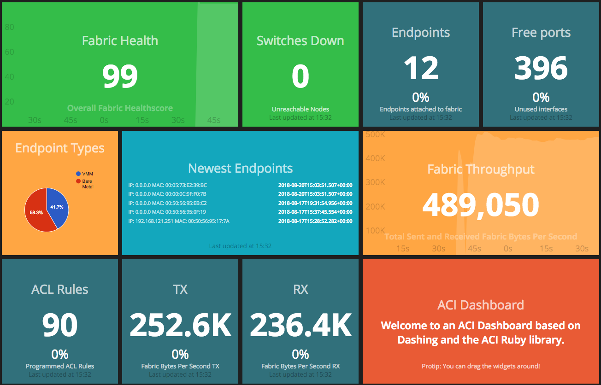

# Overview
This repository provides an example of how to create a dashboard that pulls statistics from an ACI fabric in real-time like this...



# Prerequisites
- We recommend running with Docker to avoid complexity when installing dependencies.  Make sure your server has Docker installed.

# Installation
- Clone this repo
- Change into the acirb/examples/acidashboard folder  
```
cd acirb/examples/acidashboard
```
- Modify jobs/apic.erb to include your APIC IP address and credentials with an account that can query the objects being polled
```
apicuri = 'https://apic'
username = 'admin'
password = 'password'
```

# Running
- Start the Docker Container
```
docker run -v=/local/path/to/aci-dashboard/jobs:/jobs -v=/local/path/to/aci-dashboard/widgets:/widgets -v=/local/path/to/aci-dashboard/dashboards:/dashboards -d -e GEMS=acirb -p 3030:3030 frvi/dashing
```
- Wait a couple minutes and access your local web server at http://DASHBOARD-SERVER-IP:3030
- If the container does not have IP access to the APIC, the container will automatically quit.  
- For troubleshooting leverage:
```
docker logs CONTAINERID
```

# More information
Check out http://shopify.github.com/dashing for more information about dashing
